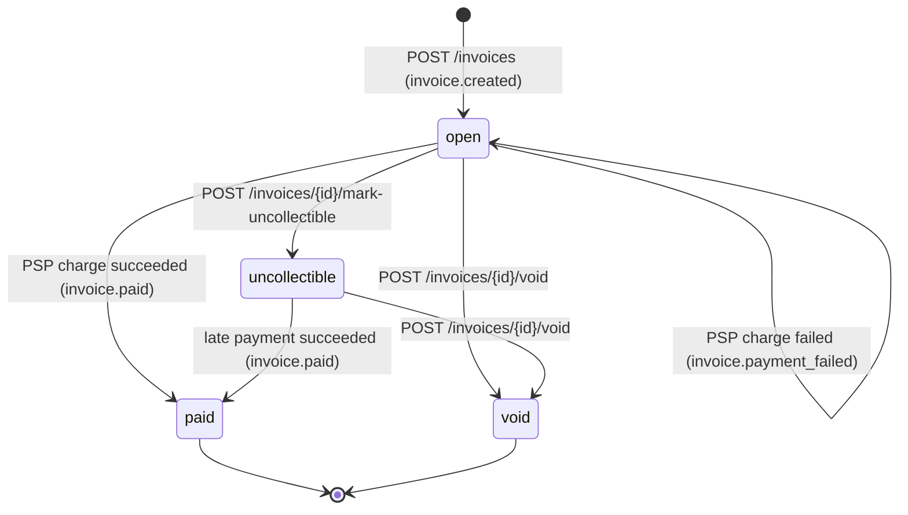

# Design: Invoice & Payment Service

The service has three binaries: **api** (HTTP API, webhook worker and payment reconciler in one process), **mockpsp** (the payment processor, reached over HTTP) and **webhooksink** (a demo receiver that verifies signatures). It uses one Postgres database.

```
client ──HTTP──► api ──tx──► Postgres ◄──poll── webhook worker ──signed POST──► business endpoint
                  │                     ◄──poll── reconciler ──GET /charges/{id}──┐
                  └──── POST /charges (5s timeout) ───────────► mock PSP ◄─────────┘
```

## 1. Data Model

All primary keys are **UUIDv7**, generated in the app. They are not guessable across tenants (unlike serial IDs), and because they are time-ordered, inserts land at the right-hand edge of the B-tree, which random UUIDv4 keys don't. Every tenant-owned row carries `business_id`, and every query filters on it.

| Table | Shape / notes | Indexes |
|---|---|---|
| `businesses` | id, name | PK |
| `api_keys` | business_id, `prefix` (display only), `key_hash` (SHA-256), revoked_at | unique `key_hash` (the auth lookup), `business_id` |
| `customers` | business_id, name, email | `(business_id, created_at DESC, id DESC)` for keyset pagination |
| `invoices` | business_id, customer_id, `status` (CHECK), `currency` (CHECK = 'USD'), `total_cents BIGINT CHECK > 0`, due_date, paid/voided/uncollectible timestamps | `(business_id, created_at, id)`, `(business_id, status, created_at, id)` for `?status=` filtering |
| `invoice_line_items` | PK `(invoice_id, position)`, quantity, unit_amount_cents, `amount_cents` with `CHECK (amount_cents = quantity * unit_amount_cents)` | PK |
| `payment_attempts` | invoice_id, status (pending/succeeded/failed), amount_cents, card_token, psp_ref, failure_code, `next_check_at`, `check_count` | **partial unique** `(invoice_id) WHERE status='pending'` and `(invoice_id) WHERE status='succeeded'`; `(next_check_at) WHERE pending` for the reconciler |
| `idempotency_keys` | PK `(business_id, key)`, `request_hash`, `payment_attempt_id`, `response_status`, `response_body BYTEA` | PK, `payment_attempt_id` |
| `webhook_endpoints` | business_id, url, secret, disabled_at | `business_id` |
| `events` | business_id, type, `data JSONB` (the event log and the outbox) | `(business_id, created_at, id)` |
| `webhook_deliveries` | event_id, endpoint_id, status, attempt_count, next_attempt_at, last_response_status/error; unique `(event_id, endpoint_id)` | `(next_attempt_at) WHERE status='pending'` |

**Why this shape over the alternatives**
- **Money is `BIGINT` cents everywhere.** Go uses `int64`, and arithmetic goes through `internal/money` with overflow checks. The database refuses inconsistent line items through a CHECK constraint, and the request decoder rejects `10.5` or a client-supplied `total_cents` field.
- **Line items get their own table**, not a JSONB column, so the database can enforce the amount invariant.
- **Payment attempts are rows, not columns on the invoice.** We need the history, and the two partial unique indexes make "never two in flight" and "never two successful charges" database guarantees, not just application logic.
- **The response body is stored as `bytea`**, not `jsonb`. jsonb reorders keys, and a replay must return exactly the bytes sent the first time.

**At 100x scale**
- Partition `events` and `webhook_deliveries` by month and archive old partitions.
- Give `idempotency_keys` a TTL (24h, cleaned up by a job).
- Serve list endpoints from a read replica.
- Move delivery to a real queue that is still fed from the outbox.
- Every hot path is already scoped by `business_id`, so sharding by tenant is possible later.

## 2. Invoice State Machine



- **Terminal states:** `paid` and `void`.
- **`uncollectible` is not terminal.** A business writes the invoice off, but the customer can still pay late (the money is real), or the business can void it.
- **A failed payment is not a state.** The invoice stays `open` and can be retried. The failure is recorded on the `payment_attempt`, and only that history needs it.
- **Reversibility:** only `open → uncollectible → paid/void` is a step back toward collection. Nothing leaves `paid` (that would be a refund, which is out of scope) or `void`.
- **No `draft` state.** It only makes sense with invoice editing, which isn't in scope. An immutable draft would just be a second name for `open`.
- **How invalid transitions are rejected:** the whole machine is one table in `internal/invoice/statemachine.go`. Every transition calls `Transition(from, action)` while holding the invoice row lock. Anything not in the table returns **409 `invalid_state_transition`**, with `current_status` and `allowed_actions` in `details`.
- **void and mark-uncollectible are refused while an attempt is pending** (409 `payment_in_progress`). Otherwise an invoice could be voided while the card is being charged.

## 3. Payment Correctness & Failure Modes

`POST /invoices/{id}/pay` runs in three steps (`internal/payment/payment.go`). **No database transaction is ever held across the PSP call.**

1. **Reserve** (one transaction):
   - `INSERT` the idempotency key.
   - `SELECT … FOR UPDATE` the invoice.
   - Check that it's payable and has no pending attempt.
   - Insert a **`pending` attempt** with `next_check_at = now()+10s`.
   - Commit.
2. **Charge:** call the PSP with a **5s timeout**, using the **attempt ID as the PSP idempotency key**. The context is detached from the client connection, so a client disconnect can't abort the call.
3. **Apply** (one transaction):
   - Lock the invoice, then the attempt (always in that order).
   - Return early if the attempt is no longer pending.
   - Record the outcome, transition the invoice, emit the event and store the response on the idempotency key.

**Concurrency mechanism: a row-level lock (`SELECT … FOR UPDATE`) on the invoice, backed by partial unique indexes.**
- The lock gives deterministic, explainable errors (`payment_in_progress` and `invoice_already_paid`) and serializes `/pay`, `/void` and the reconciler on one obvious resource.
- **Advisory locks** aren't tied to the row and are easy to leak through a connection pool.
- **Optimistic concurrency / status-conditional updates** handle the final `open → paid` write, but not "is another attempt in flight?". We'd still need the unique index, and every loser would get a generic retry.
- **SERIALIZABLE** would push retry-on-abort into every code path for a guarantee we only need on one row.
- The lock is held only for a few milliseconds, never during network I/O.

**(a) Two simultaneous `/pay` calls for one invoice.**
- Both reach `SELECT … FOR UPDATE`. One wins, inserts its pending attempt and commits.
- The other then sees the pending attempt and gets **409 `payment_in_progress`** (or `invoice_already_paid` if it arrives after success).
- The PSP is called once. Even if a code path skipped the check, the partial unique index on `(invoice_id) WHERE status='pending'` would reject the second insert.
- `TestConcurrentPaymentsChargeOnce` fires 25 parallel requests and asserts one 200, one PSP call, one succeeded attempt and status `paid`.
- If both calls use the **same** idempotency key, the second `INSERT … ON CONFLICT DO NOTHING` blocks on the first's uncommitted key, then replays it.

**(b) PSP timeout (`tok_timeout`, 30s).**
- After 5s the client gives up. The endpoint returns **202** with the attempt `pending` and the invoice still `open`. While it stays pending, new payments and void get 409.
- After 10s the **reconciler** (`reconciler.go`) claims the attempt (`FOR UPDATE SKIP LOCKED`, safe with several instances) and calls `GET /charges/{attempt_id}`:
  - `processing` → check again with exponential backoff (10s, 20s, 40s, …, max 5 min).
  - `succeeded` → the invoice becomes `paid` and `invoice.paid` is emitted.
- The caller finds out in any of three ways: the **webhook**, `GET /invoices/{id}`, or **retrying with the same Idempotency-Key**, which returns 202 while pending and the final stored response afterwards.
- `ReconcileAfter` (10s) is forced to exceed the PSP timeout (5s), so the reconciler never races the original call.
- For **`tok_network_error`** the PSP has no record, so the lookup returns 404. That means no money moved, so the attempt is marked `failed` (`processor_unavailable`) and the invoice can be paid again.

**(c) The PSP succeeds but we crash before persisting.**
- The pending attempt was committed *before* the PSP call, so it survives the crash with `next_check_at` set.
- After restart, the reconciler asks the PSP about that attempt ID, sees `succeeded` and applies it. **No double charge**, for two reasons:
  - New `/pay` requests are blocked by the pending attempt (409).
  - Any retry of the *same* attempt reuses the same PSP idempotency key.
- A client retrying with its original key gets 202 (pending), then the final 200.

**(d) Idempotency key reused with a different body.**
- We store `sha256("pay:" + invoice_id + ":" + canonical JSON body)`. On a mismatch we return **422 `idempotency_key_reused`** and execute nothing.
- Keys are scoped per business, so tenants can't collide.
- Deterministic rejections (404, `invoice_already_paid`) are also stored, so a replay is always identical. Pure validation failures (missing token, malformed JSON) happen before the key is touched.

**(e) `/pay` on a `paid` invoice.**
- Under the row lock the status is `paid`, so we return **409 `invoice_already_paid`** and never call the PSP. The response is stored against the key.

## 4. Webhook Design

- **Outbox:** `webhook.Emit` writes the event plus one `webhook_deliveries` row per active endpoint **in the same transaction as the state change**. An event exists if and only if the change committed. The API does no network I/O, and the response returns at commit.
- **Worker** (`worker.go`):
  - Every second it claims due rows with `FOR UPDATE SKIP LOCKED` and sets a **60s lease** by pushing `next_attempt_at` forward. A crashed worker's rows become due again, so delivery is **at least once**.
  - Each POST has a 10s timeout, and any 2xx counts as success.
- **Signing:**
  - `Webhook-Signature: t=<unix>,v1=hex(HMAC-SHA256(endpoint_secret, "<t>.<raw body>"))`, plus `Webhook-Id` (the event ID) and `Webhook-Event`.
  - The timestamp is inside the MAC. Receivers reject anything older than **5 minutes** (replay protection) and dedupe on `Webhook-Id` (we deliver at least once).
  - Comparison is constant-time. `webhook.Verify` is the reference implementation the sink uses.
- **Retries:** attempt 1 is immediate, then waits of **30s, 2m, 10m, 1h, 6h, 24h**. That is **7 attempts over about 31h42m**, enough to survive an overnight outage at the receiver.
- **When retries run out:** the delivery is marked `failed` and kept, along with the last status and error.
- **Reconciliation:** `GET /v1/events?type=&starting_after=` is the source of truth. Every event has its delivery state inline, and a business pages through it after an outage. A manual "redeliver" endpoint is cut (§6).
- **Ordering is not guaranteed.** Payloads carry the full invoice snapshot, and receivers should treat `invoice.status` as authoritative.

## 5. API Key Model

- **Generation:** `sk_` + base64url(32 bytes from `crypto/rand`), which is 256 bits of entropy.
- **Storage:** only `SHA-256(key)`, plus an 11-character `prefix` so humans can tell keys apart in `GET /v1/api-keys`.
  - A slow hash (bcrypt/argon2) is for low-entropy passwords. A 256-bit random key can't be brute-forced, and a fast hash keeps authentication to one indexed lookup.
  - Comparing via an index lookup leaks nothing useful, because an attacker can't choose hash preimages.
- **Transmission:** `Authorization: Bearer sk_…`, only over TLS in production (terminated at the load balancer). Keys never go in URLs and are never logged; the app logs only the prefix.
- **Rotation:** `POST /v1/api-keys` (a new key, shown once), deploy it, then `DELETE /v1/api-keys/{id}`. A business can hold several active keys, so rotation needs no downtime.
- **Revocation:** sets `revoked_at`. Nothing is cached, so it takes effect on the next request.
- **Blast radius if a key leaks:** full control of **one** business:
  - read customers' PII,
  - create and void invoices,
  - attempt payments with tokens it has,
  - register a webhook URL to exfiltrate future events.
- **It can't reach other tenants**: every query is scoped and cross-tenant IDs return 404. Mitigations I would add next: scoped/restricted keys, an audit log, and alerts on new webhook endpoints.

## 6. What I Cut and Why

1. **The `draft` state and invoice editing.** Editing isn't required, and a draft with no editing is just `open` under another name.
2. **Idempotency on create endpoints** (customers and invoices). Only `/pay` moves money. The same table and middleware pattern would extend to them.
3. **Webhook hardening:** a manual redeliver endpoint, encrypting secrets at rest (they're plaintext because HMAC needs them), **SSRF protection** on endpoint URLs (blocking private IP ranges), and auto-disabling endpoints that keep failing.
4. **Refunds and partial payments.** Out of scope. They would be new `refund` rows against a succeeded attempt, never a transition out of `paid`.
5. **Idempotency key expiry (TTL)**, and a manual-review queue for attempts that stay unresolved for a long time.

## 7. Production Readiness Gap

1. **Observability and alerting.** Today there are only structured logs with request IDs. We need metrics and alerts for pending-attempt age, reconciler backlog, dead webhooks, PSP latency and error rate, plus tracing across the API → PSP hop. An attempt stuck `pending` is where money and state can drift.
2. **Rate limiting and abuse controls**, per API key and per invoice on `/pay` (card testing), plus restricted key scopes.
3. **An audit log and money-correction tools:** who voided what, an immutable ledger of attempts, refunds, and a runbook path for the "charge succeeded on an unpayable invoice" alarm already logged in `ApplyResult`.
